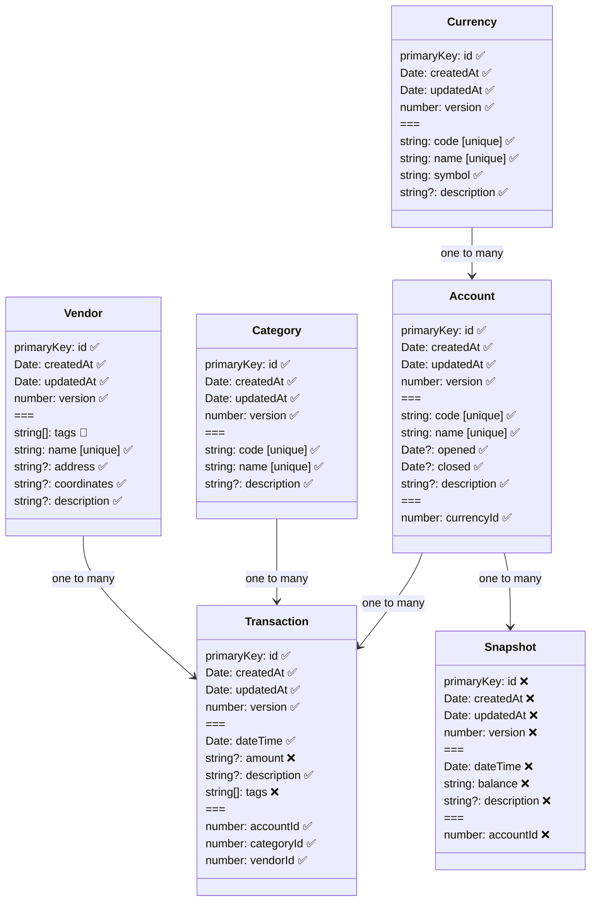

# Shadow Badger CLI

This is a command line tool to manage a shadow budget. It is currently in active development and doesn't yet have a beta version.

## Domain Model Diagram

This is the planned domain model.

## Next Steps

- implement tags for vendors as simple array fields
  - [x] rename tagify to tag
  - [x] rename remove-tag to untag
  - [x] add untag command and function to vendor
  - [x] ensure all vendor tests have a tags field
- implement tagging and untagging for transactions
  - [x] add tags to schema and interface for transactions
  - [x] update all transactions fixtures to have a tags field
  - [x] check editVendor tag replacement
  - [ ] implement editTransaction tag replacement
  - [ ] add tagging feature for transactions (manual testing), copying from vendors
  - [ ] add untagging feature for transactions (manual testing), copying from vendors
- make view commands work by regex
- snapshots
- format coordinates nicely
- implement view-tags command for vendors and transactions
- make accounts and transactions viewable by relation id
- make vendors searchable by GPS with precision
