# Shadow Badger CLI

This is a command line tool to manage a shadow budget. It is currently in active development and doesn't yet have a beta version.

## Domain Model Diagram

This is the planned domain model.

```mermaid
classDiagram

class Currency {
  primaryKey: id ✅
  Date: createdAt ✅
  Date: updatedAt ✅
  number: version ✅
  ===
  string: code [unique] ✅
  string: name [unique] ✅
  string: symbol ✅
  string?: description ✅
}

class Category {
  primaryKey: id ✅
  Date: createdAt ✅
  Date: updatedAt ✅
  number: version ✅
  ===
  string: code [unique] ✅
  string: name [unique] ✅
  string?: description ✅
}

class Account {
  primaryKey: id ✅
  Date: createdAt ✅
  Date: updatedAt ✅
  number: version ✅
  ===
  string: code [unique] ✅
  string: name [unique] ✅
  Date?: opened ✅
  Date?: closed ✅
  string?: description ✅
  ===
  number: currencyId ✅
}

class Vendor {
  primaryKey: id ✅
  Date: createdAt ✅
  Date: updatedAt ✅
  number: version ✅
  ===
  string[]: tags ✅
  string: name [unique] ✅
  string?: address ✅
  string?: coordinates ✅
  string?: description ✅
}

class Transaction {
  primaryKey: id ✅
  Date: createdAt ✅
  Date: updatedAt ✅
  number: version ✅
  ===
  Date: dateTime ✅
  string?: amount ✅
  string?: description ✅
  string[]: tags ✅
  ===
  number: accountId ✅
  number: categoryId ✅
  number: vendorId ✅
}

class Snapshot {
  primaryKey: id ❌
  Date: createdAt ❌
  Date: updatedAt ❌
  number: version ❌
  ===
  Date: dateTime ❌
  string: balance ❌
  string?: description ❌
  ===
  number: accountId ❌
}

Currency --> Account: one to many
Account --> Transaction: one to many
Category --> Transaction: one to many
Vendor --> Transaction: one to many
Account --> Snapshot: one to many
```

## Next Steps

**getting schema version 1 out**

- 🔁 snapshots

**formatting of input data**

- format coordinates nicely
- get current date when adding transactions

**convenience**

- specify query SQL query type (LIKE, IN, etc.)
- search transactions by dateTime range
- calculate balance on a certain day and today
- search relation by code, not id
- make vendors searchable by GPS with precision
- implement view-tags command for vendors and transactions
